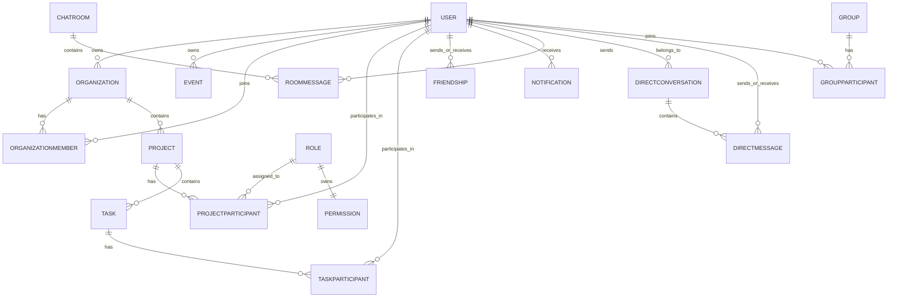

*This project has been created as part of the 42 curriculum by fzucconi, mchiaram, aosmenaj, gvigano, specifically to complete it by finalizing the last assignment, [Ft_Transcendence](en.subject.pdf).*

| Name | GitHub | LinkedIn |
| :--- | :--- | :--- |
| Fabio Zucconi | [@tarrapunchia](https://github.com/Tarrapunchia) | [Link with me](https://www.linkedin.com/in/fabio-zucconi-221b95173/) |
| Ansi Aosmenaj | [@aosmenaj](https://github.com/aosmenaj) | [Link with me](https://www.linkedin.com/in/ansi-osmenaj-94a95020a/) |
| Manuel Chiaramello | [@chiaramellomanuel](https://github.com/chiaramellomanuel) | [Link with me](https://www.linkedin.com/in/manuel-chiaramello/) |
| Giulia Viganò | [@giuliavigano](https://github.com/giuliavigano) | [Link with me](https://www.linkedin.com/in/giulia-vigan%C3%B2-88219b402/) |


# Project X — Collaborative Workspace Platform

## Table of Contents
1. [Description](#description)
2. [Key Features](#key-features)
3. [Team Information](#team-information)
4. [Project Management](#project-management)
5. [Technical Stack](#technical-stack)
6. [Database Schema](#database-schema)
7. [Features List](#features-list)
8. [Modules](#modules)
9. [Individual Contributions](#individual-contributions)
10. [Instructions](#instructions)
11. [Technical Choices and Rationale](#technical-choices-and-rationale)
12. [Resources](#resources)
13. [DevOps](#features-list-addendum) 

## Description

**Project X** is a full-stack collaborative workspace platform built as the final Common Core project of the 42 curriculum. Instead of building a game-centered product, our team chose to design a productivity-oriented web application focused on **organizations, projects, tasks, events, files, chat, and real-time team collaboration**.

The project combines a React frontend, a Fastify backend, a SQLite database managed through Prisma, WebSocket-driven real-time features, and containerized deployment. The main goal is to provide a centralized environment where users can:

- sign up and authenticate securely
- manage their profile and avatar
- create and join organizations
- manage projects and tasks
- upload, preview, download, and delete files
- communicate through direct and room-based chat
- receive live updates, invitations, and activity alerts
- work through a single dashboard with calendars, notifications, and analytics widgets

This repository contains the full application stack and the documentation needed to understand the architecture, the team organization, the selected modules, and the implementation choices.

---

## Key Features

- Email/password authentication with hashed credentials
- Google OAuth integration
- JWT-based session handling through HTTP-only cookies
- User profiles with avatar upload and default avatar fallback
- Friendship system with requests, acceptance, rejection, blocking, and online presence
- Organization management with memberships and invitations
- Project and task management with role-based permissions
- Event calendar integration and time-based alerts
- Direct and room-based real-time chat with WebSockets
- File upload, preview, download, and deletion with access control
- Swagger/OpenAPI documentation for the REST API
- Containerized deployment with dedicated Dockerfiles for backend and frontend

---

## Team Information

All four team members acted as **developers**, while also taking on explicit project roles required by the subject.

### Fabio Zucconi (`fzucconi`) — Product Owner / Developer
Fabio acted as **Product Owner** and was responsible for the **entire backend stack**:
- backend architecture
- Fastify server design
- REST API design and implementation
- Prisma schema and database architecture
- authentication, cookies, and JWT session management
- WebSocket server-side logic
- security-related backend checks
- containerization of the full project

He also maintained the overall product direction from the backend/product perspective and validated major functional milestones.

### Manuel Chiaramello (`mchiaram`) — Project Manager / Scrum Master / Developer
Manuel acted as **Project Manager / Scrum Master** and, together with Ansi, implemented the **frontend application**. His responsibilities also included:
- team coordination
- meeting organization
- progress follow-up
- helping keep feature delivery aligned across frontend and backend

### Ansi Osmenaj (`aosmenaj`) — Technical Lead / Architect / Developer
Ansi acted as **Technical Lead / Architect** and, together with Manuel, implemented the **frontend architecture and UI**. He focused in particular on:
- frontend technical structure
- dashboard and application flows
- file upload / download user experience
- integration of frontend modules with backend APIs

### Giulia Vigano (`gvigano`) — Developer / Backend Research Support
Giulia contributed as a **developer with backend research and support responsibilities**, focusing on:
- WebSocket-related research
- backend architecture support
- technical discussion and validation of backend-oriented choices

---

## Project Management

The subject requires the team roles, work organization, and coordination method to be documented clearly. Our workflow was organized around **feature ownership**, **shared reviews**, and **regular synchronization meetings**.

### How the work was organized

The application was divided into clearly separated work areas:

- **Backend core**: server bootstrap, API routing, authentication, DB design, cookies, WebSockets, security, and containerization
- **Frontend core**: application layout, dashboard pages, navigation, profile, project/task UI, chat UI, file library UI, and API integration
- **Research/support**: WebSocket behavior, backend structure review, and technical cross-checking
- **Coordination**: task planning, milestone tracking, and synchronization between frontend and backend delivery

### Coordination method

The team used a lightweight collaboration model based on:

- repository-based task ownership
- recurring team meetings
- feature-level coordination between backend and frontend
- direct peer review and discussion for critical decisions

### Project management tools and communication

The main coordination mechanisms were:

- the Git repository and commit history for traceable work distribution
- recurring team meetings led by the Scrum Master
- day-to-day direct team communication for blockers, clarifications, and testing feedback

This lightweight process matched the actual team size and allowed us to keep momentum without over-engineering project management.

---

## Technical Stack

### Frontend

- **React 19**
- **TypeScript**
- **Vite**
- **Tailwind CSS**
- **React Router**
- **Chart.js / react-chartjs-2**
- **FullCalendar / react-big-calendar**
- **lucide-react / react-icons**
- **react-markdown + remark-gfm**

**Why this choice:**  
React and Vite provided a fast development workflow and a component-based structure well suited for a dashboard-style collaborative application. Tailwind CSS allowed rapid iteration on UI while keeping styling reusable and maintainable.

### Backend

- **Node.js**
- **Fastify**
- **TypeScript**
- **Prisma ORM**
- **@fastify/websocket**
- **@fastify/jwt**
- **@fastify/cookie**
- **@fastify/cors**
- **@fastify/multipart**
- **@fastify/swagger** / **@fastify/swagger-ui**
- **fastify-metrics**
- **bcrypt-ts**

**Why this choice:**  
Fastify gave us a modular, high-performance backend with a clean plugin model and strong TypeScript support. It was particularly suitable for combining REST APIs, JWT authentication, OpenAPI documentation, file handling, and WebSocket endpoints in one coherent codebase.

### Database

- **SQLite**, managed through **Prisma**

**Why this choice:**  
SQLite was a pragmatic choice for a team project with a relational data model and no external DB dependency during development. Prisma gave us type-safe queries, migrations, and an explicit schema that made the domain model easier to reason about and document.

### Dev / Deployment

- **Docker**
- **Docker Compose**
- **nginx** (frontend serving / deployment path)
- self-signed certificate workflow during local HTTPS testing

---

## Database Schema

The database is centered around collaborative workspaces and user interaction.

### Core entities

- **User**
- **Organization**
- **OrganizationMember**
- **Project**
- **ProjectParticipant**
- **Role**
- **Permission**
- **Task**
- **TaskParticipant**
- **Event**
- **EventParticipant**
- **Friendship**
- **Notification**
- **Group**
- **GroupParticipant**
- **ChatRoom**
- **RoomMessage**
- **DirectConversation**
- **DirectMessage**
- **OrganizationJoinRequest**
- **GroupJoinRequest**

### Relationship overview



### Design notes

- **Organizations** contain **projects**
- **Projects** contain **tasks**
- **Membership** and **participation** use dedicated join tables
- **Project access control** is role-based (`OWNER`, `EDITOR`, `VIEWER`) and backed by a dedicated `Permission` model
- **Chat** is split between:
  - room-based messaging for organizations/projects/groups
  - direct private conversations between users
- **Friendship** and **notification** models support invitations, pending requests, acceptance/rejection flows, and live updates
- **Events** and **tasks** are tied to the dashboard calendar / alert logic

---

## Features List

### 1. Authentication and session management
**Contributors:** Fabio Zucconi, Manuel Chiaramello, Ansi Osmenaj  
Users can register with email/password, log in, log out, and authenticate with Google OAuth. Sessions are managed through JWT tokens stored in HTTP-only cookies.

### 2. User profile and avatar management
**Contributors:** Fabio Zucconi, Manuel Chiaramello, Ansi Osmenaj  
Users have profile data, avatar support, profile pages, and update flows. A default avatar is provided when no user-specific avatar is uploaded.

### 3. Friendship system and presence
**Contributors:** Fabio Zucconi, Manuel Chiaramello, Ansi Osmenaj, Giulia Vigano  
Users can send, accept, reject, block, and unblock friendship requests. Online presence is propagated through WebSockets and reflected in the UI.

### 4. Organization management
**Contributors:** Fabio Zucconi, Manuel Chiaramello, Ansi Osmenaj  
Users can create organizations, edit them, invite members, manage memberships, and browse organization-related content.

### 5. Project and task management
**Contributors:** Fabio Zucconi, Manuel Chiaramello, Ansi Osmenaj  
Projects belong to organizations and contain tasks. The application supports task status, priority, due dates, participants, and role-aware project access.

### 6. File library and uploads
**Contributors:** Fabio Zucconi, Ansi Osmenaj, Manuel Chiaramello  
The platform supports file upload, preview, download, and deletion for organization/project contexts with validation and permission checks.

### 7. Real-time communication
**Contributors:** Fabio Zucconi, Manuel Chiaramello, Ansi Osmenaj, Giulia Vigano  
WebSockets are used for direct chat, room chat, presence updates, invitations, request handling, and activity refreshes.

### 8. Notifications and alerts
**Contributors:** Fabio Zucconi, Manuel Chiaramello, Ansi Osmenaj  
The dashboard aggregates pending requests and deadline/event alerts. Live notifications are pushed when relevant WebSocket events are received.

### 9. Dashboard and analytics widgets
**Contributors:** Manuel Chiaramello, Ansi Osmenaj  
The dashboard includes visual widgets such as calendar views, priority charts, and notification panels to help users monitor activity.

### 10. Documentation and API discoverability
**Contributors:** Fabio Zucconi  
The backend exposes Swagger/OpenAPI documentation and multiple route groups for users, organizations, projects, tasks, messages, files, groups, and events.

### 11. Containerization
**Contributors:** Fabio Zucconi  
The repository includes separate Dockerfiles for backend and frontend and a Compose-based deployment path for running the project in containers.

---

## Modules

The subject requires at least **14 points** in validated modules. We kept the module claim intentionally conservative: only items that can be directly mapped to the current codebase are counted.

### Claimed modules

| Category | Module | Type | Points | Why we claim it | Main contributors |
|---|---|---:|---:|---|---|
| Web | Use a framework for both frontend and backend | Major | 2 | React is used on the frontend and Fastify on the backend | Manuel, Ansi, Fabio |
| Web | Real-time features using WebSockets | Major | 2 | WebSocket-based presence, chat, invitations, and live updates are implemented | Fabio, Giulia, Manuel, Ansi |
| Web | Allow users to interact with other users | Major | 2 | The project includes chat, profiles, and a friendship system | Fabio, Manuel, Ansi |
| Web | Use an ORM for the database | Minor | 1 | Prisma is used throughout the backend | Fabio |
| Web | File upload and management system | Minor | 1 | Upload, preview, download, and delete flows are implemented with access checks | Fabio, Ansi, Manuel |
| Web |  Custom-made design system with reusable components | Minor | 1 | All done with custom components | Ansi, Manuel |
| Web |  Implement advanced search functionality | Minor | 1 | For events, specifically | Ansi, Manuel, Fabio |
| Web |  A complete notification system for all actions | Minor | 1 | GET, POST, PUT, DELETES | Fabio |
| Accessibility and Internationalization | Support for at least 2 additional browser - Chrome, Firefox, Brave - | Minor | 1 | Full compatibility with at least 2 additional browsers  | Manuel, Ansi |
| Accessibility and Internationalization | Support for multiple languages, at least 3 languages | Minor | 1 | Implement i18n (internationalization) system. | Manuel, Ansi |
| User Management | Standard user management and authentication | Major | 2 | Profile editing, avatar support, friendship presence, and secure login flows are implemented | Fabio, Manuel, Ansi |
| User Management | Remote authentication with OAuth 2.0 | Minor | 1 | Google OAuth flow is implemented server-side and integrated into the UI | Fabio, Manuel, Ansi |
| User Management | Advanced permissions system | Major | 2 | Role-based project access with `OWNER / EDITOR / VIEWER` and permission checks is implemented | Fabio, Manuel, Ansi |
| User Management | Organization system | Major | 2 | Organizations, memberships, invitations, and organization-scoped actions are implemented | Fabio, Manuel, Ansi |
| User Experience | Advanced chat features, enhances the basic chat from "User interaction" | Minor | 1 | Ability to block users from messaging you, chat history persistence | Fabio, Manuel, Ansi, Giulia |
| Devops | Monitoring system with Prometheus and Grafana | Major | 2 | Prometheus is configured to collect backend metrics, integrations are configured through Docker Compose and provisioning files, Grafana loads a custom FT_TRANSCENDENCE dashboard automatically, alert rules are configured, and access to Grafana is protected through credentials and controlled exposure | Fabio, Giulia |


### Total

**23 points total**

- **Mandatory threshold:** 14 points
- **Claimed total:** 23 points

### Modules deliberately not claimed

To remain honest and evaluation-safe, the README does **not** claim some partially related features as full modules:

- **Public API with secured API key**: the codebase contains Swagger documentation, REST endpoints, and route-level rate limiting, but the API-key hardening requirement is not claimed as completed.

---

## Individual Contributions

### Fabio Zucconi (`fzucconi`)
- designed and implemented the Fastify backend
- designed the Prisma schema and database relationships
- implemented authentication, JWT cookies, session flows, and Google OAuth backend support
- implemented user, friendship, organization, project, task, file, event, message, and group APIs
- implemented server-side WebSocket logic
- implemented backend-side permission checks and file access control
- handled backend deployment and containerization

### Manuel Chiaramello (`mchiaram`)
- co-developed the frontend application
- worked on dashboard flows, page integration, and user-facing UI behavior
- coordinated meetings and team synchronization
- ensured that frontend work remained aligned with backend delivery

### Ansi Osmenaj (`aosmenaj`)
- co-developed the frontend architecture
- handled important frontend sections, especially file-related UI flows
- worked on dashboard, documents, project/task views, and general frontend integration
- contributed to architecture-level frontend decisions

### Giulia Vigano (`gvigano`)
- contributed research and support for backend architecture
- focused especially on WebSocket-related understanding and validation
- helped review and support backend-oriented technical choices

---

## Instructions

### Prerequisites

- Node.js
- npm
- Docker and Docker Compose (for containerized execution)
- Google OAuth credentials if you want to use the Google login flow
- a local `.env` file for backend configuration

### Backend environment variables

At minimum, the backend expects values for:

```env
DATABASE_URL=file:./prisma/dev.db
GOOGLE_CLIENT_ID=your_google_client_id
GOOGLE_CLIENT_SECRET=your_google_client_secret
GOOGLE_REDIRECT_URI=http://localhost:5000/auth/google/callback
HTTPS=
NODE_ENV=development
```

### Local development setup

#### 1. Backend

```bash
cd backend
npm install
./init.sh
```

This initializes the database when needed and starts the backend in development mode.

Useful backend scripts:

```bash
npm run build:ts
npm run build
npm run dev
npm run start
```

Swagger documentation is exposed at:

```text
http://localhost:5000/docs
```

#### 2. Frontend

```bash
cd frontend
npm install
npm run dev
```

By default, the frontend uses Vite for local development.

### Containerized execution

The repository includes Dockerfiles for both backend and frontend, plus Compose files used to containerize the application stack.

A typical entry point from the repository root is:

```bash
docker compose up --build
```

### Notes about HTTPS

The subject requires HTTPS for any connection reaching the backend from outside the backend itself. The project therefore includes a containerization path where the frontend / nginx side is the public-facing entry point, while internal container-to-container communication can remain unencrypted.

---

## Technical Choices and Rationale

### Why React + Fastify
We wanted a stack that gave us fast iteration, strong TypeScript support, and clear separation of frontend and backend responsibilities. React and Fastify matched that goal well.

### Why Prisma + SQLite
Prisma gave us a strongly typed ORM and a clean schema-first workflow. SQLite kept the setup lightweight and easy to reproduce during development.

### Why WebSockets
Real-time collaboration and social interaction are central to the product. Presence, chat, invitations, and live request handling are much better served with persistent bidirectional communication than with simple polling.

### Why a collaboration/productivity application
The subject allows several project directions beyond games. Our team chose to build a collaborative workspace because it naturally supports rich relational data, multi-user interaction, permissions, files, events, and real-time features.

---

## Known Limitations / Current Scope

To keep the module declaration honest, this README does not overstate incomplete areas.

Current limitations include:

- no game-related modules, since the project direction is collaborative/productivity oriented
- no claimed public API key module
- privacy policy and terms pages should be finalized and linked explicitly from the application if they are not already part of the final evaluation build
- the container/HTTPS deployment path should be tested end-to-end in the final submission environment

---

## Resources

### Technical references

- Fastify documentation
- Prisma documentation
- React documentation
- Vite documentation
- Tailwind CSS documentation
- nginx documentation
- Google OAuth / OpenID Connect documentation
- WebSocket protocol references

### Internal project documentation present in the repository

- `GUIDE.md`
- `Frontend.md`
- `backend/GUIDE.md`
- `backend/README.md`
- `frontend/README.md`

### AI usage

AI tools were used primarily for:

- reducing repetitive documentation work
- checking wording and README structure
- discussing debugging hypotheses during containerization and integration work
- cross-checking the project against the subject requirements

Following the subject guidelines, AI output was never treated as authoritative by itself. Suggestions were reviewed by team members, compared with the actual repository structure, and only kept when they were fully understood and validated by the team.

---

## Final Note

This README is intentionally written to be:

- clear
- complete
- professionally structured
- conservative in module claims
- honest about scope and current limitations

---

## Technical Stack Addendum — Monitoring and Observability

The project also includes a monitoring and observability stack based on:

- **Prometheus**
- **Grafana**
- backend operational endpoints (`/health`, `/ready`, `/status`)
- Docker Compose-based provisioning for the monitoring services
- custom alert rules and a custom backend dashboard

This monitoring layer extends the original containerized architecture and provides visibility over backend health, readiness, runtime performance, and request latency.

---

## Features List Addendum

### 12. Monitoring and observability stack
**Contributors:** Fabio Zucconi, Giulia Vigano  
The project includes a DevOps monitoring layer built around Prometheus and Grafana. Prometheus scrapes the backend metrics endpoint, evaluates alert rules, and stores time-series data. Grafana automatically provisions a Prometheus datasource and loads a custom FT_TRANSCENDENCE backend monitoring dashboard showing service state, latency, throughput, memory usage, heap usage, event loop lag, GC activity, and operational endpoint metrics for `/health`, `/ready`, and `/status`.

---

## Modules Addendum

This addendum supplements the module list above without removing or replacing any of the already listed modules.

---

## Instructions Addendum — Monitoring Stack

The monitoring stack is started together with the application through Docker Compose.

### Monitoring services

The Compose setup now includes:

- `prometheus`
- `grafana`

### Monitoring configuration files

Typical monitoring files used by the project include:

```txt
monitoring/prometheus/prometheus.yml
monitoring/prometheus/alerts.yml
monitoring/grafana/provisioning/datasources/datasource.yml
monitoring/grafana/provisioning/dashboards/dashboard.yml
monitoring/grafana/dashboards/ft_transcendence_backend_monitoring.json
```

### Startup

From the repository root:

```bash
docker compose up --build
```

### Monitoring URLs

Typical local URLs are:

```txt
Frontend:   https://localhost:8443
Prometheus: http://localhost:9090
Grafana:    http://localhost:3000
```

### Grafana access

Grafana is configured with explicit credentials and with anonymous access disabled. The dashboard is provisioned automatically at startup.

### What the dashboard shows

The FT_TRANSCENDENCE backend dashboard includes:

- backend UP/DOWN state
- requests per second
- P95 latency
- resident memory
- request rate by route
- P95 latency by route
- event loop lag
- heap usage
- GC duration rate
- operational endpoint traffic for `/health`, `/ready`, and `/status`

### Evaluation/demo flow for the monitoring module

A practical evaluation demonstration can be:

1. start the full stack with Docker Compose
2. open Prometheus and verify that the backend scrape target is `UP`
3. open Grafana and show the provisioned dashboard
4. call `/health`, `/ready`, and `/status`
5. refresh Grafana and show changes in traffic and latency graphs
6. explain the configured alert rules and secure access to Grafana

---

## Technical Choices Addendum

### Why Prometheus + Grafana
Prometheus and Grafana were chosen because they integrate well with Fastify/Node.js metrics exposure and because they make it possible to demonstrate a real monitoring workflow rather than a passive status page only.

Prometheus provides:
- metric collection
- rule evaluation
- alerting support

Grafana provides:
- custom dashboards
- readable operational views
- a strong evaluation/demo interface for the DevOps monitoring module

### Why this was a good fit for the project
The backend already exposed Prometheus-style metrics and operational endpoints. Building on top of that foundation allowed the team to add a production-style monitoring layer without changing the core application architecture.

---

## Resources Addendum

Additional references used for the monitoring module:

- Prometheus documentation
- Grafana documentation
- Grafana provisioning documentation
- PromQL query documentation
- Fastify metrics plugin documentation
