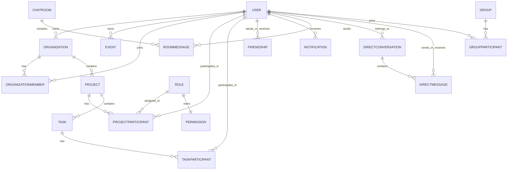

*Este proyecto ha sido creado como parte del currículo de 42 por fzucconi, mchiaram, aosmenaj, gvigano.*

# Project X — Plataforma colaborativa de espacio de trabajo

## Descripción

**Project X** es una plataforma full-stack para espacios de trabajo colaborativos construida como proyecto final del Common Core de 42. En lugar de crear un producto centrado en juegos, el equipo eligió diseñar una aplicación web orientada a la productividad, enfocada en **organizaciones, proyectos, tareas, eventos, archivos, chat y colaboración en tiempo real entre miembros del equipo**.

El proyecto combina un frontend React, un backend Fastify, una base de datos SQLite gestionada mediante Prisma, funciones en tiempo real basadas en WebSocket y despliegue containerizado. El objetivo principal es proporcionar un entorno centralizado en el que los usuarios puedan:

- registrarse y autenticarse de forma segura
- gestionar su perfil y avatar
- crear y unirse a organizaciones
- gestionar proyectos y tareas
- subir, previsualizar, descargar y eliminar archivos
- comunicarse mediante chat directo y chat por salas
- recibir actualizaciones en vivo, invitaciones y alertas de actividad
- trabajar a través de un único dashboard con calendarios, notificaciones y widgets analíticos

Este repositorio contiene todo el stack de la aplicación y la documentación necesaria para entender la arquitectura, la organización del equipo, los módulos seleccionados y las decisiones de implementación.

---

## Funcionalidades principales

- Autenticación por email/password con credenciales hasheadas
- Integración con Google OAuth
- Gestión de sesión basada en JWT mediante cookies HTTP-only
- Perfiles de usuario con subida de avatar y avatar por defecto como fallback
- Sistema de amistades con solicitudes, aceptación, rechazo, bloqueo y presencia online
- Gestión de organizaciones con membresías e invitaciones
- Gestión de proyectos y tareas con permisos basados en roles
- Integración de calendario de eventos y alertas basadas en tiempo
- Chat en tiempo real directo y por salas mediante WebSockets
- Subida de archivos, vista previa, descarga y eliminación con control de acceso
- Documentación Swagger/OpenAPI para la REST API
- Despliegue containerizado con Dockerfiles dedicados para backend y frontend

---

## Información del equipo

Los cuatro miembros del equipo actuaron como **developers**, además de asumir roles explícitos requeridos por el subject.

### Fabio Zucconi (`fzucconi`) — Product Owner / Developer
Fabio actuó como **Product Owner** y fue responsable de **todo el stack backend**:
- arquitectura backend
- diseño del servidor Fastify
- diseño e implementación de la REST API
- esquema Prisma y arquitectura de base de datos
- autenticación, cookies y gestión de sesiones JWT
- lógica WebSocket del lado servidor
- controles backend relacionados con seguridad
- containerización de todo el proyecto

También mantuvo la dirección global del producto desde la perspectiva backend/producto y validó los principales hitos funcionales.

### Manuel Chiaramello (`mchiaram`) — Project Manager / Scrum Master / Developer
Manuel actuó como **Project Manager / Scrum Master** y, junto con Ansi, implementó el **frontend** de la aplicación. Sus responsabilidades incluían además:
- coordinación del equipo
- organización de reuniones
- seguimiento del progreso
- ayudar a mantener alineada la entrega entre frontend y backend

### Ansi Osmenaj (`aosmenaj`) — Technical Lead / Architect / Developer
Ansi actuó como **Technical Lead / Architect** y, junto con Manuel, implementó la **arquitectura y la UI del frontend**. Se centró especialmente en:
- estructura técnica del frontend
- dashboard y flujos de la aplicación
- experiencia de usuario para subida/descarga de archivos
- integración de módulos frontend con APIs backend

### Giulia Vigano (`gvigano`) — Developer / Soporte de investigación backend
Giulia contribuyó como **developer con responsabilidades de investigación y soporte backend**, centrándose en:
- investigación relacionada con WebSockets
- soporte a la arquitectura backend
- discusión técnica y validación de decisiones orientadas al backend

---

## Project Management

El subject exige que los roles del equipo, la organización del trabajo y el método de coordinación estén documentados claramente. Nuestro flujo de trabajo se organizó alrededor de **ownership por funcionalidad**, **revisiones compartidas** y **reuniones regulares de sincronización**.

### Cómo se organizó el trabajo

La aplicación se dividió en áreas de trabajo claramente separadas:

- **Core backend**: bootstrap del servidor, routing API, autenticación, diseño de BD, cookies, WebSockets, seguridad y containerización
- **Core frontend**: layout de la aplicación, páginas del dashboard, navegación, perfil, UI de proyecto/tarea, UI de chat, UI de biblioteca de archivos e integración API
- **Investigación/soporte**: comportamiento WebSocket, revisión de estructura backend y comprobaciones técnicas cruzadas
- **Coordinación**: planificación de tareas, seguimiento de hitos y sincronización entre entregas frontend y backend

### Método de coordinación

El equipo utilizó un modelo de colaboración ligero basado en:

- ownership de tareas a nivel de repositorio
- reuniones periódicas de equipo
- coordinación por funcionalidad entre frontend y backend
- peer review directa y discusión para decisiones críticas

### Herramientas de project management y comunicación

Los principales mecanismos de coordinación fueron:

- el repositorio Git y el historial de commits para una distribución trazable del trabajo
- reuniones periódicas lideradas por el Scrum Master
- comunicación directa diaria del equipo para bloqueos, aclaraciones y feedback de testing

Este proceso ligero encajó con el tamaño real del equipo y nos permitió mantener el ritmo sin sobreingenierizar la gestión del proyecto.

---

## Stack técnico

### Frontend

- **React 19**
- **TypeScript**
- **Vite**
- **Tailwind CSS**
- **React Router**
- **Chart.js / react-chartjs-2**
- **FullCalendar / react-big-calendar**
- **lucide-react / react-icons**
- **react-markdown + remark-gfm**

**Por qué esta elección:**  
React y Vite nos dieron un flujo de desarrollo rápido y una estructura basada en componentes muy adecuada para una aplicación colaborativa estilo dashboard. Tailwind CSS permitió iterar rápidamente sobre la UI manteniendo estilos reutilizables y mantenibles.

### Backend

- **Node.js**
- **Fastify**
- **TypeScript**
- **Prisma ORM**
- **@fastify/websocket**
- **@fastify/jwt**
- **@fastify/cookie**
- **@fastify/cors**
- **@fastify/multipart**
- **@fastify/swagger** / **@fastify/swagger-ui**
- **fastify-metrics**
- **bcrypt-ts**

**Por qué esta elección:**  
Fastify nos proporcionó un backend modular y de alto rendimiento con un modelo de plugins limpio y un fuerte soporte para TypeScript. Era especialmente adecuado para combinar REST APIs, autenticación JWT, documentación OpenAPI, manejo de archivos y endpoints WebSocket en una sola arquitectura coherente.

### Base de datos

- **SQLite**, gestionada mediante **Prisma**

**Por qué esta elección:**  
SQLite fue una elección pragmática para un proyecto de equipo con modelo de datos relacional y sin dependencia de una base de datos externa durante el desarrollo. Prisma nos dio consultas type-safe, migraciones y un esquema explícito que hizo más sencillo razonar y documentar el dominio.

### Dev / Deployment

- **Docker**
- **Docker Compose**
- **nginx** (servido/despliegue del frontend)
- flujo con certificados autofirmados para pruebas HTTPS locales

---

## Esquema de base de datos

La base de datos está centrada en espacios de trabajo colaborativos e interacción de usuario.

### Entidades core

- **User**
- **Organization**
- **OrganizationMember**
- **Project**
- **ProjectParticipant**
- **Role**
- **Permission**
- **Task**
- **TaskParticipant**
- **Event**
- **EventParticipant**
- **Friendship**
- **Notification**
- **Group**
- **GroupParticipant**
- **ChatRoom**
- **RoomMessage**
- **DirectConversation**
- **DirectMessage**
- **OrganizationJoinRequest**
- **GroupJoinRequest**

### Vista general de relaciones



### Notas de diseño

- Las **Organizations** contienen **Projects**
- Los **Projects** contienen **Tasks**
- **Membership** y **participation** usan tablas de unión dedicadas
- El **control de acceso de proyectos** es role-based (`OWNER`, `EDITOR`, `VIEWER`) y está respaldado por un modelo `Permission` dedicado
- El **chat** se divide entre:
  - mensajería por salas para organizaciones/proyectos/grupos
  - conversaciones privadas directas entre usuarios
- Los modelos **Friendship** y **Notification** soportan invitaciones, solicitudes pendientes, flujos de aceptación/rechazo y actualizaciones live
- **Events** y **Tasks** están ligados a la lógica de calendario/alertas del dashboard

---

## Lista de funcionalidades

### 1. Authentication and session management
**Contributors:** Fabio Zucconi, Manuel Chiaramello, Ansi Osmenaj  
Los usuarios pueden registrarse con email/password, iniciar y cerrar sesión y autenticarse con Google OAuth. Las sesiones se gestionan mediante tokens JWT almacenados en cookies HTTP-only.

### 2. User profile and avatar management
**Contributors:** Fabio Zucconi, Manuel Chiaramello, Ansi Osmenaj  
Los usuarios tienen datos de perfil, soporte de avatar, páginas de perfil y flujos de actualización. Se proporciona un avatar por defecto cuando no existe un avatar específico subido por el usuario.

### 3. Friendship system and presence
**Contributors:** Fabio Zucconi, Manuel Chiaramello, Ansi Osmenaj, Giulia Vigano  
Los usuarios pueden enviar, aceptar, rechazar, bloquear y desbloquear solicitudes de amistad. La presencia online se propaga mediante WebSockets y se refleja en la UI.

### 4. Organization management
**Contributors:** Fabio Zucconi, Manuel Chiaramello, Ansi Osmenaj  
Los usuarios pueden crear organizaciones, editarlas, invitar miembros, gestionar membresías y navegar contenido relacionado con la organización.

### 5. Project and task management
**Contributors:** Fabio Zucconi, Manuel Chiaramello, Ansi Osmenaj  
Los proyectos pertenecen a organizaciones y contienen tareas. La aplicación soporta estado de tareas, prioridad, fechas límite, participantes y acceso a proyectos según roles.

### 6. File library and uploads
**Contributors:** Fabio Zucconi, Ansi Osmenaj, Manuel Chiaramello  
La plataforma soporta subida, vista previa, descarga y eliminación de archivos en contextos de organización/proyecto con validación y controles de permisos.

### 7. Real-time communication
**Contributors:** Fabio Zucconi, Manuel Chiaramello, Ansi Osmenaj, Giulia Vigano  
Los WebSockets se usan para chat directo, chat por salas, actualizaciones de presencia, invitaciones, gestión de solicitudes y refresco de actividad.

### 8. Notifications and alerts
**Contributors:** Fabio Zucconi, Manuel Chiaramello, Ansi Osmenaj  
El dashboard agrega solicitudes pendientes y alertas de plazos/eventos. Las notificaciones en vivo se envían cuando se reciben eventos WebSocket relevantes.

### 9. Dashboard and analytics widgets
**Contributors:** Manuel Chiaramello, Ansi Osmenaj  
El dashboard incluye widgets visuales como vistas de calendario, gráficos de prioridad y paneles de notificaciones para ayudar a los usuarios a monitorizar actividad.

### 10. Documentation and API discoverability
**Contributors:** Fabio Zucconi  
El backend expone documentación Swagger/OpenAPI y múltiples grupos de rutas para users, organizations, projects, tasks, messages, files, groups y events.

### 11. Containerization
**Contributors:** Fabio Zucconi  
El repositorio incluye Dockerfiles separados para backend y frontend y una ruta de despliegue basada en Compose para ejecutar el proyecto en contenedores.

---

## Módulos

El subject requiere al menos **14 puntos** en módulos validados. Mantuvimos la declaración de módulos intencionadamente conservadora: solo contamos aquello que puede mapearse directamente al código actual.

### Módulos declarados

| Categoría | Módulo | Tipo | Puntos | Por qué lo declaramos | Main contributors |
|---|---|---:|---:|---|---|
| Web | Use a framework for both frontend and backend | Major | 2 | React se usa en el frontend y Fastify en el backend | Manuel, Ansi, Fabio |
| Web | Real-time features using WebSockets | Major | 2 | Presencia, chat, invitaciones y actualizaciones live basadas en WebSocket están implementadas | Fabio, Giulia, Manuel, Ansi |
| Web | Allow users to interact with other users | Major | 2 | El proyecto incluye chat, perfiles y sistema de amistades | Fabio, Manuel, Ansi |
| Web | Use an ORM for the database | Minor | 1 | Prisma se usa en todo el backend | Fabio |
| Web | File upload and management system | Minor | 1 | Flujos de subida, vista previa, descarga y eliminación están implementados con controles de acceso | Fabio, Ansi, Manuel |
| Web |  Custom-made design system with reusable components | Minor | 1 | Todo hecho con componentes custom | Ansi, Manuel |
| Web |  Implement advanced search functionality | Minor | 1 | Para eventos, específicamente | Ansi, Manuel, Fabio |
| Web |  A complete notification system for all actions | Minor | 1 | GET, POST, PUT, DELETES | Fabio |
| Accessibility and Internationalization | Support for at least 2 additional browser - Chrome, Firefox, Brave - | Minor | 1 | Compatibilidad completa con al menos 2 navegadores adicionales | Manuel, Ansi |
| User Management | Standard user management and authentication | Major | 2 | Edición de perfil, soporte avatar, presencia de amigos y flujos de login seguros están implementados | Fabio, Manuel, Ansi |
| User Management | Remote authentication with OAuth 2.0 | Minor | 1 | El flujo Google OAuth está implementado del lado servidor e integrado en la UI | Fabio, Manuel, Ansi |
| User Management | Advanced permissions system | Major | 2 | Acceso a proyectos basado en roles con `OWNER / EDITOR / VIEWER` y controles de permisos implementados | Fabio, Manuel, Ansi |
| User Management | Organization system | Major | 2 | Organizations, memberships, invitaciones y acciones scoped sobre organización están implementadas | Fabio, Manuel, Ansi |
| User Experience | Advanced chat features, enhances the basic chat from "User interaction" | Minor | 1 | Posibilidad de bloquear usuarios para que no te escriban, persistencia del historial de chat | Fabio, Manuel, Ansi, Giulia |
| Devops | Monitoring system with Prometheus and Grafana | Major | 2 | Prometheus está configurado para recoger métricas del backend, las integraciones están configuradas mediante Docker Compose y archivos de provisioning, Grafana carga automáticamente un dashboard custom FT_TRANSCENDENCE, las reglas de alerta están configuradas y el acceso a Grafana está protegido con credenciales y exposición controlada | Fabio, Giulia |

### Total

**22 puntos totales**

- **Umbral obligatorio:** 14 puntos
- **Total declarado:** 20 puntos

### Módulos deliberadamente no declarados

Para ser honestos y seguros en evaluation, el README **no** declara algunas funcionalidades parcialmente relacionadas como módulos completos:

- **Public API with secured API key**: el codebase contiene documentación Swagger, endpoints REST y rate limiting por ruta, pero el endurecimiento con API key no se declara como completado.

---

## Contribuciones individuales

### Fabio Zucconi (`fzucconi`)
- diseñó e implementó el backend Fastify
- diseñó el esquema Prisma y las relaciones de la base de datos
- implementó autenticación, cookies JWT, flujos de sesión y soporte backend para Google OAuth
- implementó APIs para user, friendship, organization, project, task, file, event, message y group
- implementó la lógica WebSocket del lado servidor
- implementó controles de permisos backend y control de acceso a archivos
- se encargó del despliegue backend y de la containerización

### Manuel Chiaramello (`mchiaram`)
- co-desarrolló la aplicación frontend
- trabajó en flujos del dashboard, integración de páginas y comportamiento UI de cara al usuario
- coordinó reuniones y sincronización del equipo
- se aseguró de que el trabajo frontend se mantuviera alineado con la entrega del backend

### Ansi Osmenaj (`aosmenaj`)
- co-desarrolló la arquitectura frontend
- gestionó secciones importantes del frontend, especialmente los flujos UI relacionados con archivos
- trabajó en dashboard, documentos, vistas de proyecto/tarea e integración general frontend
- contribuyó a decisiones de arquitectura del frontend

### Giulia Vigano (`gvigano`)
- contribuyó con investigación y soporte para la arquitectura backend
- se centró especialmente en la comprensión y validación de WebSockets
- ayudó a revisar y apoyar decisiones técnicas orientadas al backend

---

## Instrucciones

### Prerrequisitos

- Node.js
- npm
- Docker y Docker Compose (para ejecución containerizada)
- credenciales Google OAuth si quieres usar el login con Google
- un archivo `.env` local para la configuración backend

### Variables de entorno del backend

Como mínimo, el backend espera valores para:

```env
DATABASE_URL=file:./prisma/dev.db
GOOGLE_CLIENT_ID=your_google_client_id
GOOGLE_CLIENT_SECRET=your_google_client_secret
GOOGLE_REDIRECT_URI=http://localhost:5000/auth/google/callback
HTTPS=
NODE_ENV=development
```

### Setup de desarrollo local

#### 1. Backend

```bash
cd backend
npm install
./init.sh
```

Esto inicializa la base de datos cuando hace falta y arranca el backend en modo desarrollo.

Scripts backend útiles:

```bash
npm run build:ts
npm run build
npm run dev
npm run start
```

La documentación Swagger está expuesta en:

```text
http://localhost:5000/docs
```

#### 2. Frontend

```bash
cd frontend
npm install
npm run dev
```

Por defecto, el frontend usa Vite para el desarrollo local.

### Ejecución containerizada

El repositorio incluye Dockerfiles tanto para backend como para frontend, además de archivos Compose usados para containerizar el stack de la aplicación.

Un punto de entrada típico desde la raíz del repositorio es:

```bash
docker compose up --build
```

### Notas sobre HTTPS

El subject exige HTTPS para cualquier conexión que llegue al backend desde fuera del propio backend. Por ello, el proyecto incluye una ruta containerizada en la que frontend/nginx es el punto de entrada público, mientras que la comunicación interna entre contenedores puede permanecer sin cifrar.

---

## Elecciones técnicas y justificación

### Por qué React + Fastify
Queríamos un stack que ofreciera iteración rápida, fuerte soporte TypeScript y una separación clara de responsabilidades entre frontend y backend. React y Fastify encajaron muy bien con ese objetivo.

### Por qué Prisma + SQLite
Prisma nos dio un ORM fuertemente tipado y un flujo claro schema-first. SQLite mantuvo el setup ligero y fácil de reproducir durante el desarrollo.

### Por qué WebSockets
La colaboración en tiempo real y la interacción social son centrales en el producto. Presencia, chat, invitaciones y gestión live de solicitudes están mucho mejor resueltas con una comunicación bidireccional persistente que con simple polling.

### Por qué una aplicación de colaboración/productividad
El subject permite varias direcciones de proyecto más allá de los juegos. Nuestro equipo eligió construir un workspace colaborativo porque soporta de forma natural datos relacionales ricos, interacción multiusuario, permisos, archivos, eventos y funciones en tiempo real.

---

## Limitaciones conocidas / alcance actual

Para mantener honesta la declaración de módulos, este README no exagera áreas incompletas.

Limitaciones actuales:

- no hay módulos de juego, ya que la dirección del proyecto es colaboración/productividad
- no hay módulo de API key pública declarado
- no hay módulo full analytics declarado
- no hay módulo completo de accessibility/i18n declarado
- las páginas de privacy policy y terms deberían finalizarse y enlazarse explícitamente desde la aplicación si no forman ya parte de la build final de evaluación
- la ruta de contenedores/HTTPS debería probarse end-to-end en el entorno final de entrega

---

## Recursos

### Referencias técnicas

- documentación de Fastify
- documentación de Prisma
- documentación de React
- documentación de Vite
- documentación de Tailwind CSS
- documentación de nginx
- documentación de Google OAuth / OpenID Connect
- referencias del protocolo WebSocket

### Documentación interna del proyecto presente en el repositorio

- `GUIDE.md`
- `Frontend.md`
- `backend/GUIDE.md`
- `backend/README.md`
- `frontend/README.md`

### Uso de IA

Las herramientas de IA se usaron principalmente para:

- reducir trabajo repetitivo de documentación
- comprobar redacción y estructura de los README
- discutir hipótesis de depuración durante containerización e integración
- hacer cross-check entre el proyecto y los requisitos del subject

Siguiendo las directrices del subject, la salida de IA nunca se trató como autoritativa por sí sola. Las sugerencias fueron revisadas por miembros del equipo, comparadas con la estructura real del repositorio y mantenidas solo cuando fueron plenamente entendidas y validadas.

---

## Nota final

Este README está intencionadamente escrito para ser:

- claro
- completo
- estructurado profesionalmente
- conservador en la declaración de módulos
- honesto respecto al alcance y a las limitaciones actuales

---

## Addendum de stack técnico — Monitorización y observabilidad

El proyecto también incluye una pila de monitorización y observabilidad basada en:

- **Prometheus**
- **Grafana**
- endpoints operativos del backend (`/health`, `/ready`, `/status`)
- provisioning de servicios de monitorización basado en Docker Compose
- reglas de alerta custom y un dashboard backend custom

Esta capa de monitorización amplía la arquitectura containerizada original y aporta visibilidad sobre health, readiness, rendimiento de runtime backend y latencia de peticiones.

---

## Addendum de lista de funcionalidades

### 12. Monitoring and observability stack
**Contributors:** Fabio Zucconi, Giulia Vigano  
El proyecto incluye una capa DevOps de monitorización construida sobre Prometheus y Grafana. Prometheus hace scrape del endpoint de métricas del backend, evalúa reglas de alerta y almacena series temporales. Grafana provisiona automáticamente un datasource Prometheus y carga un dashboard custom FT_TRANSCENDENCE Backend Monitoring que muestra estado del servicio, latencia, throughput, uso de memoria, uso de heap, event loop lag, actividad de GC y métricas de los endpoints operativos `/health`, `/ready` y `/status`.

---

## Addendum de instrucciones — Monitoring Stack

La pila de monitorización se inicia junto con la aplicación mediante Docker Compose.

### Servicios de monitorización

La configuración Compose ahora incluye:

- `prometheus`
- `grafana`

### Archivos de configuración de monitorización

Los archivos típicos de monitorización usados por el proyecto incluyen:

```txt
monitoring/prometheus/prometheus.yml
monitoring/prometheus/alerts.yml
monitoring/grafana/provisioning/datasources/datasource.yml
monitoring/grafana/provisioning/dashboards/dashboard.yml
monitoring/grafana/dashboards/ft_transcendence_backend_monitoring.json
```

### Inicio

Desde la raíz del repositorio:

```bash
docker compose up --build
```

### URLs de monitorización

Las URLs locales típicas son:

```txt
Frontend:   https://localhost:8443
Prometheus: http://localhost:9090
Grafana:    http://localhost:3000
```

### Acceso a Grafana

Grafana está configurada con credenciales explícitas y acceso anónimo deshabilitado. El dashboard se provisiona automáticamente al arranque.

### Qué muestra el dashboard

El dashboard backend FT_TRANSCENDENCE incluye:

- estado backend UP/DOWN
- peticiones por segundo
- latencia P95
- memoria residente
- tasa de peticiones por ruta
- latencia P95 por ruta
- event loop lag
- uso de heap
- GC duration rate
- tráfico en endpoints operativos `/health`, `/ready` y `/status`

### Flujo de demo/evaluación para el módulo de monitorización

Una demostración práctica durante la evaluación puede ser:

1. arrancar todo el stack con Docker Compose
2. abrir Prometheus y verificar que el target de scrape del backend está `UP`
3. abrir Grafana y mostrar el dashboard provisionado
4. llamar a `/health`, `/ready` y `/status`
5. refrescar Grafana y mostrar cambios en gráficos de tráfico y latencia
6. explicar las reglas de alerta configuradas y el acceso seguro a Grafana

---

## Addendum de decisiones técnicas

### Por qué Prometheus + Grafana
Prometheus y Grafana fueron elegidos porque se integran bien con la exposición de métricas de Fastify/Node.js y permiten demostrar un flujo de monitorización real en lugar de solo una status page pasiva.

Prometheus proporciona:
- recolección de métricas
- evaluación de reglas
- soporte de alertas

Grafana proporciona:
- dashboards custom
- vistas operativas legibles
- una fuerte interfaz de demo/evaluación para el módulo DevOps de monitorización

### Por qué era una buena ampliación para el proyecto
El backend ya exponía métricas estilo Prometheus y endpoints operativos. Construir sobre esa base permitió al equipo añadir una capa de monitorización tipo producción sin cambiar la arquitectura core de la aplicación.

---

## Addendum de recursos

Referencias adicionales usadas para el módulo de monitorización:

- documentación de Prometheus
- documentación de Grafana
- documentación de provisioning de Grafana
- documentación de PromQL
- documentación del plugin Fastify metrics
