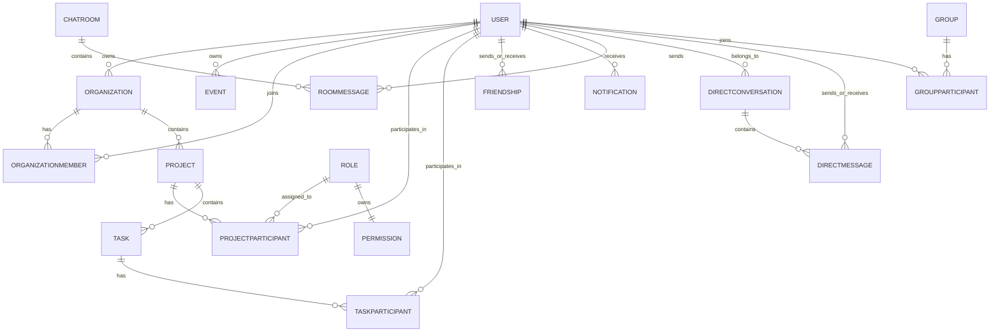

*Questo progetto è stato creato come parte del curriculum 42 da fzucconi, mchiaram, aosmenaj, gvigano.*

# Project X — Piattaforma collaborativa per workspace

## Descrizione

**Project X** è una piattaforma full-stack per workspace collaborativi realizzata come progetto finale del Common Core di 42. Invece di costruire un prodotto centrato sul gaming, il team ha scelto di progettare una web application orientata alla produttività, focalizzata su **organizzazioni, progetti, task, eventi, file, chat e collaborazione realtime tra membri del team**.

Il progetto combina un frontend React, un backend Fastify, un database SQLite gestito tramite Prisma, funzionalità realtime basate su WebSocket e deploy containerizzato. L'obiettivo principale è fornire un ambiente centralizzato in cui gli utenti possano:

- registrarsi e autenticarsi in modo sicuro
- gestire profilo e avatar
- creare e unirsi a organizzazioni
- gestire progetti e task
- caricare, visualizzare in preview, scaricare ed eliminare file
- comunicare tramite chat dirette e chat di stanza
- ricevere aggiornamenti live, inviti e alert di attività
- lavorare attraverso un'unica dashboard con calendari, notifiche e widget analitici

Questo repository contiene l'intero stack applicativo e la documentazione necessaria per comprendere architettura, organizzazione del team, moduli selezionati e scelte implementative.

---

## Funzionalità principali

- Autenticazione email/password con credenziali hashate
- Integrazione Google OAuth
- Gestione sessione basata su JWT tramite cookie HTTP-only
- Profili utente con upload avatar e avatar di default fallback
- Sistema di amicizie con richieste, accettazione, rifiuto, blocco e presenza online
- Gestione organizzazioni con membership e inviti
- Gestione di progetti e task con permessi basati sui ruoli
- Integrazione calendario eventi e alert basati sul tempo
- Chat realtime dirette e di stanza tramite WebSocket
- Upload file, preview, download ed eliminazione con controllo accessi
- Documentazione Swagger/OpenAPI per la REST API
- Deploy containerizzato con Dockerfile dedicati per backend e frontend

---

## Informazioni sul team

Tutti e quattro i membri del team hanno agito come **developer**, assumendo anche ruoli espliciti richiesti dal subject.

### Fabio Zucconi (`fzucconi`) — Product Owner / Developer
Fabio ha agito come **Product Owner** ed è stato responsabile dell'**intero stack backend**:
- architettura backend
- progettazione del server Fastify
- progettazione e implementazione delle REST API
- schema Prisma e architettura del database
- autenticazione, cookie e gestione sessioni JWT
- logica server-side WebSocket
- controlli backend legati alla sicurezza
- containerizzazione dell'intero progetto

Ha inoltre mantenuto la direzione complessiva del prodotto dal punto di vista backend/prodotto e validato le principali milestone funzionali.

### Manuel Chiaramello (`mchiaram`) — Project Manager / Scrum Master / Developer
Manuel ha agito come **Project Manager / Scrum Master** e, insieme ad Ansi, ha implementato il **frontend** dell'applicazione. Le sue responsabilità includevano anche:
- coordinamento del team
- organizzazione delle riunioni
- monitoraggio dei progressi
- supporto all'allineamento tra delivery frontend e backend

### Ansi Osmenaj (`aosmenaj`) — Technical Lead / Architect / Developer
Ansi ha agito come **Technical Lead / Architect** e, insieme a Manuel, ha implementato l'**architettura e la UI frontend**. Si è concentrato in particolare su:
- struttura tecnica del frontend
- dashboard e flussi applicativi
- esperienza utente di upload/download file
- integrazione tra moduli frontend e API backend

### Giulia Vigano (`gvigano`) — Developer / Supporto ricerca backend
Giulia ha contribuito come **developer con responsabilità di ricerca e supporto backend**, concentrandosi su:
- ricerca relativa ai WebSocket
- supporto all'architettura backend
- discussione tecnica e validazione delle scelte backend-oriented

---

## Project Management

Il subject richiede che ruoli del team, organizzazione del lavoro e metodo di coordinamento siano documentati chiaramente. Il nostro workflow è stato organizzato attorno a **ownership per feature**, **review condivise** e **riunioni di sincronizzazione regolari**.

### Come è stato organizzato il lavoro

L'applicazione è stata suddivisa in aree di lavoro chiaramente separate:

- **Core backend**: bootstrap server, routing API, autenticazione, design DB, cookie, WebSocket, sicurezza e containerizzazione
- **Core frontend**: layout applicativo, pagine dashboard, navigazione, profilo, UI progetto/task, UI chat, UI file library e integrazione API
- **Ricerca/supporto**: comportamento WebSocket, review della struttura backend e cross-check tecnici
- **Coordinamento**: pianificazione task, tracciamento milestone e sincronizzazione tra delivery frontend e backend

### Metodo di coordinamento

Il team ha usato un modello di collaborazione leggero basato su:

- ownership dei task a livello repository
- riunioni ricorrenti di team
- coordinamento per feature tra frontend e backend
- peer review diretta e confronto per le decisioni critiche

### Strumenti di project management e comunicazione

I principali meccanismi di coordinamento sono stati:

- repository Git e commit history per una distribuzione del lavoro tracciabile
- riunioni ricorrenti guidate dallo Scrum Master
- comunicazione quotidiana diretta per blocchi, chiarimenti e feedback di testing

Questo processo leggero era coerente con la dimensione reale del team e ci ha permesso di mantenere ritmo senza sovra-ingegnerizzare il project management.

---

## Stack tecnico

### Frontend

- **React 19**
- **TypeScript**
- **Vite**
- **Tailwind CSS**
- **React Router**
- **Chart.js / react-chartjs-2**
- **FullCalendar / react-big-calendar**
- **lucide-react / react-icons**
- **react-markdown + remark-gfm**

**Perché questa scelta:**  
React e Vite ci hanno fornito un workflow di sviluppo rapido e una struttura a componenti molto adatta a un'applicazione collaborativa in stile dashboard. Tailwind CSS ha permesso iterazioni rapide sulla UI mantenendo lo styling riutilizzabile e manutenibile.

### Backend

- **Node.js**
- **Fastify**
- **TypeScript**
- **Prisma ORM**
- **@fastify/websocket**
- **@fastify/jwt**
- **@fastify/cookie**
- **@fastify/cors**
- **@fastify/multipart**
- **@fastify/swagger** / **@fastify/swagger-ui**
- **fastify-metrics**
- **bcrypt-ts**

**Perché questa scelta:**  
Fastify ci ha fornito un backend modulare e performante con un modello plugin pulito e un forte supporto TypeScript. Era particolarmente adatto a combinare REST API, autenticazione JWT, documentazione OpenAPI, gestione file e WebSocket in un'unica architettura coerente.

### Database

- **SQLite**, gestito tramite **Prisma**

**Perché questa scelta:**  
SQLite è stata una scelta pragmatica per un progetto di team con modello dati relazionale e senza dipendenze DB esterne durante lo sviluppo. Prisma ci ha fornito query type-safe, migration e uno schema esplicito che ha reso il dominio più semplice da ragionare e documentare.

### Dev / Deployment

- **Docker**
- **Docker Compose**
- **nginx** (serving/deployment del frontend)
- workflow con certificati self-signed per test HTTPS locali

---

## Schema database

Il database è centrato su workspace collaborativi e interazione utente.

### Entità core

- **User**
- **Organization**
- **OrganizationMember**
- **Project**
- **ProjectParticipant**
- **Role**
- **Permission**
- **Task**
- **TaskParticipant**
- **Event**
- **EventParticipant**
- **Friendship**
- **Notification**
- **Group**
- **GroupParticipant**
- **ChatRoom**
- **RoomMessage**
- **DirectConversation**
- **DirectMessage**
- **OrganizationJoinRequest**
- **GroupJoinRequest**

### Panoramica relazioni



### Note di design

- Le **Organizations** contengono i **Projects**
- I **Projects** contengono i **Tasks**
- **Membership** e **partecipation** usano join table dedicate
- Il **controllo accessi dei progetti** è role-based (`OWNER`, `EDITOR`, `VIEWER`) e supportato da un modello `Permission` dedicato
- La **chat** è divisa tra:
  - messaggistica di stanza per organizzazioni/progetti/gruppi
  - conversazioni private dirette tra utenti
- I modelli **Friendship** e **Notification** supportano inviti, richieste pending, flussi di accettazione/rifiuto e aggiornamenti live
- **Events** e **Tasks** sono legati alla logica di calendario/alert della dashboard

---

## Elenco funzionalità

### 1. Authentication and session management
**Contributors:** Fabio Zucconi, Manuel Chiaramello, Ansi Osmenaj  
Gli utenti possono registrarsi con email/password, fare login, logout e autenticarsi con Google OAuth. Le sessioni sono gestite tramite token JWT memorizzati in cookie HTTP-only.

### 2. User profile and avatar management
**Contributors:** Fabio Zucconi, Manuel Chiaramello, Ansi Osmenaj  
Gli utenti hanno dati profilo, supporto avatar, pagine profilo e flussi di aggiornamento. Viene fornito un avatar di default quando non esiste un avatar specifico caricato.

### 3. Friendship system and presence
**Contributors:** Fabio Zucconi, Manuel Chiaramello, Ansi Osmenaj, Giulia Vigano  
Gli utenti possono inviare, accettare, rifiutare, bloccare e sbloccare richieste di amicizia. La presenza online viene propagata tramite WebSocket e riflessa nella UI.

### 4. Organization management
**Contributors:** Fabio Zucconi, Manuel Chiaramello, Ansi Osmenaj  
Gli utenti possono creare organizzazioni, modificarle, invitare membri, gestire membership e navigare contenuti legati all'organizzazione.

### 5. Project and task management
**Contributors:** Fabio Zucconi, Manuel Chiaramello, Ansi Osmenaj  
I progetti appartengono alle organizzazioni e contengono task. L'applicazione supporta stato task, priorità, scadenze, partecipanti e accesso ai progetti basato sui ruoli.

### 6. File library and uploads
**Contributors:** Fabio Zucconi, Ansi Osmenaj, Manuel Chiaramello  
La piattaforma supporta upload, preview, download ed eliminazione di file in contesti organizzazione/progetto con validazione e controlli permesso.

### 7. Real-time communication
**Contributors:** Fabio Zucconi, Manuel Chiaramello, Ansi Osmenaj, Giulia Vigano  
I WebSocket vengono usati per chat dirette, chat di stanza, aggiornamenti di presenza, inviti, gestione richieste e refresh di attività.

### 8. Notifications and alerts
**Contributors:** Fabio Zucconi, Manuel Chiaramello, Ansi Osmenaj  
La dashboard aggrega richieste pending e alert su scadenze/eventi. Le notifiche live vengono pushate quando arrivano eventi WebSocket rilevanti.

### 9. Dashboard and analytics widgets
**Contributors:** Manuel Chiaramello, Ansi Osmenaj  
La dashboard include widget visivi come viste calendario, priority chart e pannelli notifiche per aiutare gli utenti a monitorare l'attività.

### 10. Documentation and API discoverability
**Contributors:** Fabio Zucconi  
Il backend espone documentazione Swagger/OpenAPI e più gruppi di route per users, organizations, projects, tasks, messages, files, groups ed events.

### 11. Containerization
**Contributors:** Fabio Zucconi  
Il repository include Dockerfile separati per backend e frontend e un path di deployment basato su Compose per eseguire il progetto in container.

---

## Moduli

Il subject richiede almeno **14 punti** in moduli validati. Abbiamo mantenuto la dichiarazione dei moduli intenzionalmente conservativa: contiamo solo ciò che può essere ricondotto direttamente al codebase attuale.

### Moduli dichiarati

| Categoria | Modulo | Tipo | Punti | Perché lo dichiariamo | Main contributors |
|---|---|---:|---:|---|---|
| Web | Use a framework for both frontend and backend | Major | 2 | React viene usato nel frontend e Fastify nel backend | Manuel, Ansi, Fabio |
| Web | Real-time features using WebSockets | Major | 2 | Presenza, chat, inviti e aggiornamenti live basati su WebSocket sono implementati | Fabio, Giulia, Manuel, Ansi |
| Web | Allow users to interact with other users | Major | 2 | Il progetto include chat, profili e sistema di amicizie | Fabio, Manuel, Ansi |
| Web | Use an ORM for the database | Minor | 1 | Prisma viene usato in tutto il backend | Fabio |
| Web | File upload and management system | Minor | 1 | Flussi di upload, preview, download ed eliminazione sono implementati con controlli accesso | Fabio, Ansi, Manuel |
| Web |  Custom-made design system with reusable components | Minor | 1 | Tutto fatto con componenti custom | Ansi, Manuel |
| Web |  Implement advanced search functionality | Minor | 1 | Per gli eventi, nello specifico | Ansi, Manuel, Fabio |
| Web |  A complete notification system for all actions | Minor | 1 | GET, POST, PUT, DELETES | Fabio |
| Accessibility and Internationalization | Support for at least 2 additional browser - Chrome, Firefox, Brave - | Minor | 1 | Compatibilità completa con almeno 2 browser aggiuntivi | Manuel, Ansi |
| User Management | Standard user management and authentication | Major | 2 | Modifica profilo, avatar, presenza amici e flussi login sicuri sono implementati | Fabio, Manuel, Ansi |
| User Management | Remote authentication with OAuth 2.0 | Minor | 1 | Il flusso Google OAuth è implementato lato server e integrato nella UI | Fabio, Manuel, Ansi |
| User Management | Advanced permissions system | Major | 2 | Accesso ai progetti basato sui ruoli con `OWNER / EDITOR / VIEWER` e permission check implementati | Fabio, Manuel, Ansi |
| User Management | Organization system | Major | 2 | Organizations, membership, inviti e azioni scoped su organization sono implementati | Fabio, Manuel, Ansi |
| User Experience | Advanced chat features, enhances the basic chat from "User interaction" | Minor | 1 | Possibilità di bloccare utenti dalla messaggistica, persistenza cronologia chat | Fabio, Manuel, Ansi, Giulia |
| Devops | Monitoring system with Prometheus and Grafana | Major | 2 | Prometheus è configurato per raccogliere metriche backend, le integrazioni sono configurate tramite Docker Compose e file di provisioning, Grafana carica automaticamente una dashboard custom FT_TRANSCENDENCE, le alert rules sono configurate e l'accesso a Grafana è protetto tramite credenziali ed esposizione controllata | Fabio, Giulia |


### Totale

**22 punti totali**

- **Soglia obbligatoria:** 14 punti
- **Totale dichiarato:** 20 punti

### Moduli volutamente non dichiarati

Per restare onesti e sicuri in evaluation, il README **non** dichiara alcune funzionalità parzialmente correlate come moduli completi:

- **Public API with secured API key**: il codebase contiene documentazione Swagger, endpoint REST e rate limiting per route, ma il requisito di hardening API-key non viene dichiarato come completato.

---

## Contributi individuali

### Fabio Zucconi (`fzucconi`)
- ha progettato e implementato il backend Fastify
- ha progettato lo schema Prisma e le relazioni del database
- ha implementato autenticazione, cookie JWT, flussi di sessione e supporto backend Google OAuth
- ha implementato API per user, friendship, organization, project, task, file, event, message e group
- ha implementato la logica WebSocket server-side
- ha implementato permission check backend e controllo accesso file
- ha gestito deployment backend e containerizzazione

### Manuel Chiaramello (`mchiaram`)
- ha co-sviluppato l'applicazione frontend
- ha lavorato su flussi dashboard, integrazione pagine e comportamento UI user-facing
- ha coordinato riunioni e sincronizzazione del team
- ha garantito che il lavoro frontend restasse allineato con la delivery backend

### Ansi Osmenaj (`aosmenaj`)
- ha co-sviluppato l'architettura frontend
- ha gestito sezioni importanti del frontend, specialmente i flussi UI legati ai file
- ha lavorato su dashboard, documenti, viste progetto/task e integrazione frontend generale
- ha contribuito a decisioni architetturali lato frontend

### Giulia Vigano (`gvigano`)
- ha contribuito con ricerca e supporto per l'architettura backend
- si è concentrata in particolare sulla comprensione e validazione dei WebSocket
- ha aiutato a rivedere e supportare scelte tecniche backend-oriented

---

## Istruzioni

### Prerequisiti

- Node.js
- npm
- Docker e Docker Compose (per esecuzione containerizzata)
- credenziali Google OAuth se vuoi usare il login Google
- un file `.env` locale per la configurazione backend

### Variabili ambiente backend

Al minimo, il backend si aspetta valori per:

```env
DATABASE_URL=file:./prisma/dev.db
GOOGLE_CLIENT_ID=your_google_client_id
GOOGLE_CLIENT_SECRET=your_google_client_secret
GOOGLE_REDIRECT_URI=http://localhost:5000/auth/google/callback
HTTPS=
NODE_ENV=development
```

### Setup sviluppo locale

#### 1. Backend

```bash
cd backend
npm install
./init.sh
```

Questo inizializza il database quando necessario e avvia il backend in modalità development.

Script backend utili:

```bash
npm run build:ts
npm run build
npm run dev
npm run start
```

La documentazione Swagger è esposta su:

```text
http://localhost:5000/docs
```

#### 2. Frontend

```bash
cd frontend
npm install
npm run dev
```

Di default, il frontend usa Vite per lo sviluppo locale.

### Esecuzione containerizzata

Il repository include Dockerfile sia per backend che per frontend, oltre a file Compose usati per containerizzare lo stack applicativo.

Un entry point tipico dalla root del repository è:

```bash
docker compose up --build
```

### Note su HTTPS

Il subject richiede HTTPS per ogni connessione che raggiunga il backend dall'esterno del backend stesso. Il progetto include quindi un path containerizzato in cui frontend/nginx è il punto di ingresso pubblico, mentre la comunicazione interna container-to-container può restare non cifrata.

---

## Scelte tecniche e motivazioni

### Perché React + Fastify
Volevamo uno stack che offrisse iterazione rapida, forte supporto TypeScript e chiara separazione di responsabilità tra frontend e backend. React e Fastify erano una buona combinazione per questo obiettivo.

### Perché Prisma + SQLite
Prisma ci ha fornito un ORM fortemente tipizzato e un workflow chiaro schema-first. SQLite ha mantenuto il setup leggero e facilmente riproducibile durante lo sviluppo.

### Perché WebSockets
Collaborazione realtime e interazione sociale sono centrali nel prodotto. Presenza, chat, inviti e gestione live delle richieste sono serviti molto meglio da una comunicazione bidirezionale persistente che da semplice polling.

### Perché un'applicazione collaboration/productivity
Il subject consente più direzioni progettuali oltre al gaming. Il team ha scelto di costruire un workspace collaborativo perché supporta in modo naturale dati relazionali ricchi, interazione multiutente, permessi, file, eventi e funzionalità realtime.

---

## Limitazioni note / scope attuale

Per mantenere onesta la dichiarazione dei moduli, questo README non sovrastima aree incomplete.

Limitazioni attuali:

- nessun modulo legato al gaming, perché il progetto è orientato a collaboration/productivity
- nessun modulo public API key dichiarato
- nessun modulo full analytics dichiarato
- nessun modulo completo accessibility/i18n dichiarato
- privacy policy e terms pages dovrebbero essere finalizzate e collegate esplicitamente dall'app se non sono già parte della build finale di evaluation
- il path container/HTTPS dovrebbe essere testato end-to-end nell'ambiente finale di consegna

---

## Risorse

### Riferimenti tecnici

- documentazione Fastify
- documentazione Prisma
- documentazione React
- documentazione Vite
- documentazione Tailwind CSS
- documentazione nginx
- documentazione Google OAuth / OpenID Connect
- riferimenti protocollo WebSocket

### Documentazione interna al progetto presente nel repository

- `GUIDE.md`
- `Frontend.md`
- `backend/GUIDE.md`
- `backend/README.md`
- `frontend/README.md`

### Uso dell'AI

Gli strumenti AI sono stati usati principalmente per:

- ridurre il lavoro ripetitivo di documentazione
- verificare wording e struttura dei README
- discutere ipotesi di debugging durante containerizzazione e integrazione
- fare cross-check tra progetto e requisiti del subject

Seguendo le linee guida del subject, l'output AI non è mai stato trattato come autorevole di per sé. I suggerimenti sono stati revisionati dai membri del team, confrontati con la struttura reale del repository e mantenuti solo quando pienamente compresi e validati.

---

## Nota finale

Questo README è intenzionalmente scritto per essere:

- chiaro
- completo
- strutturato professionalmente
- conservativo nella dichiarazione dei moduli
- onesto rispetto a scope e limitazioni attuali

---

## Addendum Stack tecnico — Monitoraggio e osservabilità

Il progetto include anche uno stack di monitoraggio e osservabilità basato su:

- **Prometheus**
- **Grafana**
- endpoint operativi backend (`/health`, `/ready`, `/status`)
- provisioning dei servizi di monitoring basato su Docker Compose
- regole di alert custom e dashboard backend custom

Questo layer di monitoring estende l'architettura containerizzata originale e fornisce visibilità su health, readiness, performance runtime backend e latenza delle richieste.

---

## Addendum elenco funzionalità

### 12. Monitoring and observability stack
**Contributors:** Fabio Zucconi, Giulia Vigano  
Il progetto include un layer DevOps di monitoraggio costruito attorno a Prometheus e Grafana. Prometheus esegue lo scrape dell'endpoint metriche backend, valuta alert rules e memorizza time-series. Grafana provisiona automaticamente un datasource Prometheus e carica una dashboard custom FT_TRANSCENDENCE Backend Monitoring che mostra stato del servizio, latenza, throughput, uso memoria, heap usage, event loop lag, attività GC e metriche degli endpoint operativi `/health`, `/ready` e `/status`.

---

## Addendum moduli

Questo addendum integra la lista moduli sopra senza rimuovere o sostituire alcun modulo già elencato.

## Addendum istruzioni — Monitoring Stack

Lo stack di monitoring viene avviato insieme all'applicazione tramite Docker Compose.

### Servizi di monitoring

Il setup Compose ora include:

- `prometheus`
- `grafana`

### File di configurazione monitoring

I tipici file di monitoring usati dal progetto includono:

```txt
monitoring/prometheus/prometheus.yml
monitoring/prometheus/alerts.yml
monitoring/grafana/provisioning/datasources/datasource.yml
monitoring/grafana/provisioning/dashboards/dashboard.yml
monitoring/grafana/dashboards/ft_transcendence_backend_monitoring.json
```

### Startup

Dalla root del repository:

```bash
docker compose up --build
```

### URL di monitoring

Gli URL locali tipici sono:

```txt
Frontend:   https://localhost:8443
Prometheus: http://localhost:9090
Grafana:    http://localhost:3000
```

### Accesso a Grafana

Grafana è configurata con credenziali esplicite e accesso anonimo disabilitato. La dashboard viene provisionata automaticamente all'avvio.

### Cosa mostra la dashboard

La dashboard FT_TRANSCENDENCE backend include:

- stato backend UP/DOWN
- richieste al secondo
- latenza P95
- memoria residente
- request rate per route
- latenza P95 per route
- event loop lag
- heap usage
- GC duration rate
- traffico sugli endpoint operativi `/health`, `/ready` e `/status`

### Flusso demo/evaluation per il modulo monitoring

Una dimostrazione pratica in evaluation può essere:

1. avviare l'intero stack con Docker Compose
2. aprire Prometheus e verificare che il target backend di scrape sia `UP`
3. aprire Grafana e mostrare la dashboard provisionata
4. chiamare `/health`, `/ready` e `/status`
5. aggiornare Grafana e mostrare cambiamenti nei grafici di traffico e latenza
6. spiegare le alert rules configurate e l'accesso sicuro a Grafana

---

## Addendum scelte tecniche

### Perché Prometheus + Grafana
Prometheus e Grafana sono stati scelti perché si integrano bene con l'esposizione metriche Fastify/Node.js e permettono di dimostrare un workflow di monitoraggio reale invece di una semplice status page passiva.

Prometheus fornisce:
- raccolta metriche
- valutazione regole
- supporto alerting

Grafana fornisce:
- dashboard custom
- viste operative leggibili
- una forte interfaccia demo/evaluation per il modulo DevOps monitoring

### Perché era una buona estensione per il progetto
Il backend esponeva già metriche in stile Prometheus ed endpoint operativi. Costruire sopra questa base ha permesso al team di aggiungere un layer di monitoraggio in stile produzione senza modificare l'architettura core dell'applicazione.

---

## Addendum risorse

Ulteriori riferimenti usati per il modulo monitoring:

- documentazione Prometheus
- documentazione Grafana
- documentazione provisioning Grafana
- documentazione PromQL
- documentazione Fastify metrics plugin
